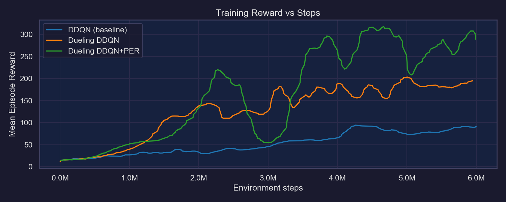
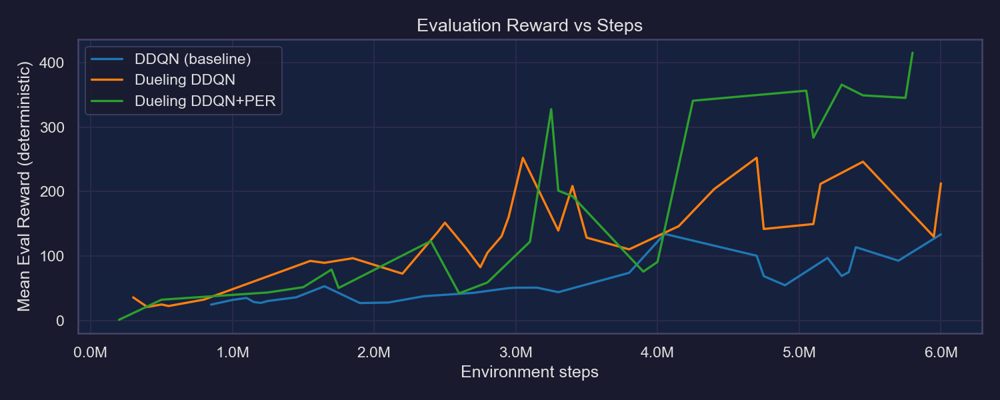
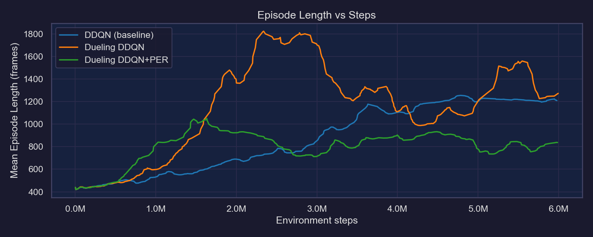
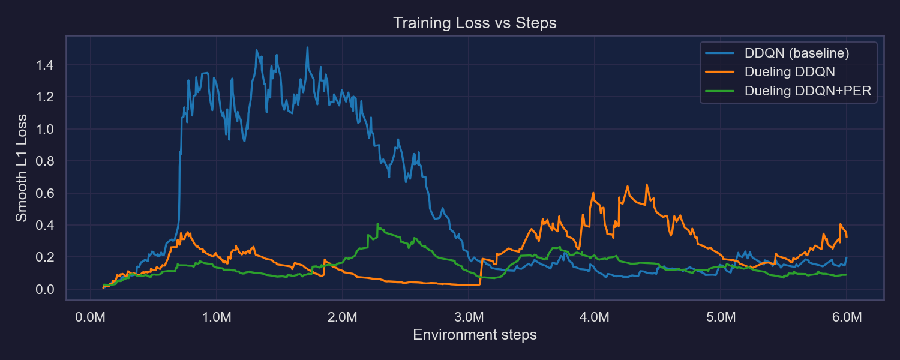
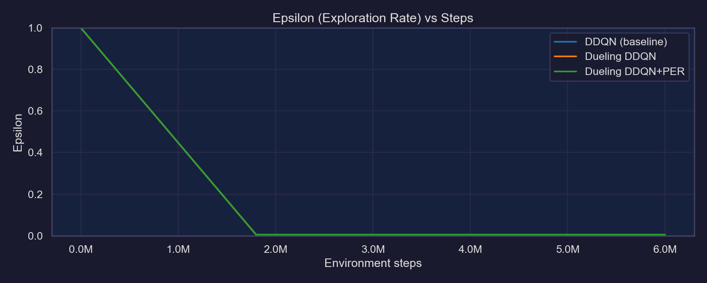
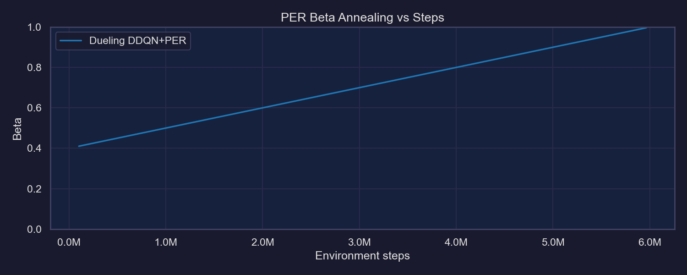
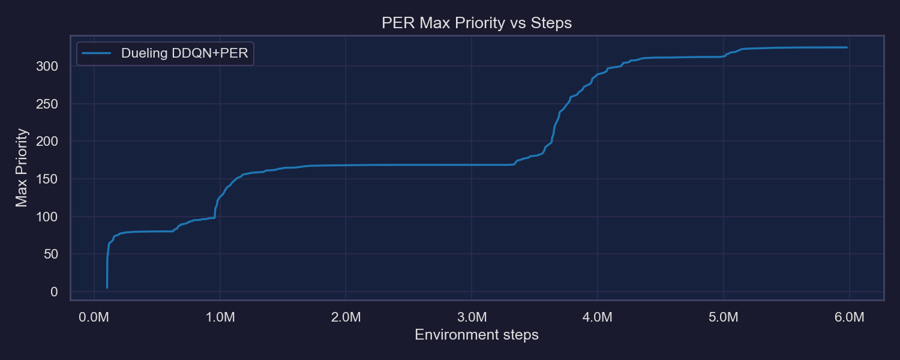
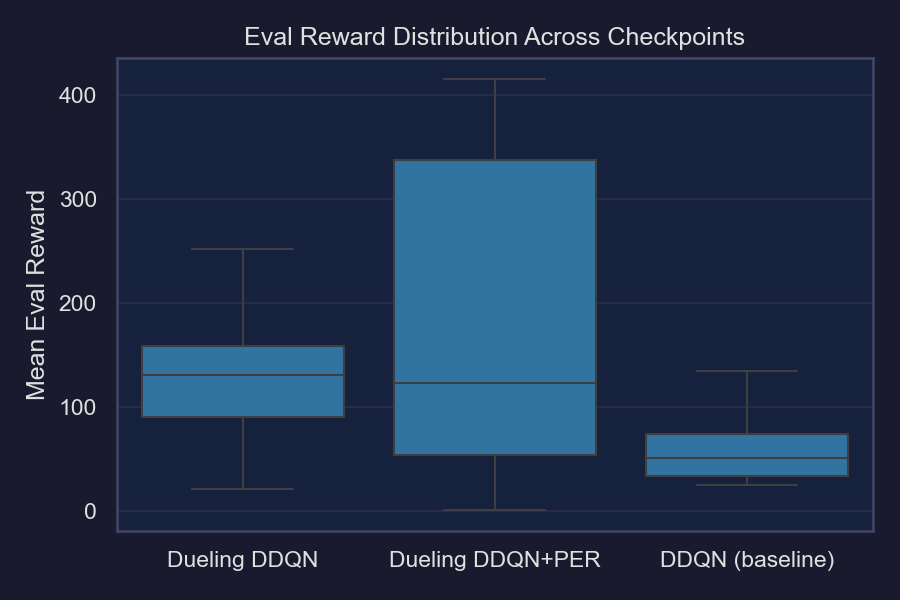

# ALE/Pacman-v5 — Training Analysis

Comparison of three progressive improvements to DQN applied to ALE/Pacman-v5, trained using Stable Baselines3 on Google Colab (T4 GPU, 6M environment steps each).

---

## Algorithms Compared

| Algorithm | Key Additions |
|---|---|
| **DDQN** | Double Q-learning — decouples action selection from evaluation to reduce overestimation bias |
| **Dueling DDQN** | Dueling architecture — splits Q-network into V(s) + A(s,a) streams for better state-value estimation |
| **Dueling DDQN + PER** | Prioritized Experience Replay — samples high-TD-error transitions more often, corrected with importance-sampling weights |

All three share the same CNN backbone (NatureDQN) and hyperparameters.

---

## Results Summary

| Run | Train Reward (final 10%) | Eval Reward (best) | Eval Reward (final 10%) | Loss (final 10%) |
|---|---|---|---|---|
| DDQN (baseline) | 86.6 | 134.3 | 113.3 | 0.2 |
| Dueling DDQN | 187.3 | 252.4 | 196.3 | 0.3 |
| **Dueling DDQN + PER** | **287.2** | **415.4** | **370.0** | **0.1** |

---

## Learning Curves

### Training Reward

The progression is clear: each improvement lifts the learning curve. DDQN plateaus around 100, Dueling DDQN reaches ~200 before becoming unstable, and Dueling DDQN+PER climbs steadily to ~300 by the end of training. PER's curve is notably smoother — the IS-weighted loss dampens the large reward swings seen in the other two runs.

### Evaluation Reward (deterministic)

The deterministic eval curve is the cleanest signal. Dueling DDQN+PER achieves a best eval of **415.4** vs **252.4** (Dueling DDQN) and **134.3** (DDQN) — roughly a 3× improvement over the baseline. Crucially, PER's final-10% eval mean (370.0) stays near its peak, while Dueling DDQN degrades (196.3) and DDQN barely improves at all (113.3), suggesting PER stabilises late-stage training.

### Episode Length

Episode length tracks reward but captures ghost-avoidance independently. PER's agent survives significantly longer on average across all of training. DDQN's episode length barely increases — the agent is not learning to avoid ghosts effectively even as it learns to collect pellets.

### Training Loss

Dueling DDQN+PER converges to a final-10% loss of **0.1** vs **0.3** (Dueling DDQN) and **0.2** (DDQN). The IS-weighted loss in PER penalises high-error transitions accurately, driving cleaner convergence. Interestingly, DDQN has lower final loss than Dueling DDQN — this is likely because Dueling DDQN's more expressive network is less stable without PER to regulate sampling.

### Exploration (Epsilon)

All three runs used the same epsilon schedule (1.0 → 0.005 over 30% of training), confirming exploration is not a confound in the comparison.

---

## PER-Specific Metrics

### Beta Annealing

Beta anneals linearly from 0.4 → 1.0 over 6M steps as designed, gradually removing the importance-sampling correction bias.

### Max Priority

Max priority rises early then plateaus, indicating the buffer stabilises after the initial exploration phase. No runaway priority growth observed, which would otherwise destabilise training.

---

## Eval Reward Distribution

Across all evaluation checkpoints, Dueling DDQN+PER has the highest median and tightest interquartile range. DDQN is concentrated at the bottom with very little variance — it learns a weak policy and sticks to it. Dueling DDQN has the widest spread, reflecting the instability seen in its learning curves.

---

## Key Findings

1. **Each improvement compounds meaningfully.** DDQN → Dueling DDQN roughly doubles best eval reward (134 → 252). Dueling DDQN → +PER adds another 65% (252 → 415). The gains are not marginal.

2. **PER's primary benefit is stability, not speed.** All three runs explore at the same rate. PER's advantage emerges in the final third of training where the other agents degrade or plateau. The final-10% eval gap (370 vs 196 vs 113) is larger than the best-eval gap (415 vs 252 vs 134), meaning PER sustains its peak rather than just reaching it faster.

3. **Dueling without PER is unstable.** The large gap between Dueling DDQN's best eval (252) and its final-10% mean (196) — combined with its higher final loss than plain DDQN — suggests the more expressive dueling architecture produces noisier gradients that PER's weighted sampling is needed to control.

4. **6M timesteps is insufficient for full convergence.** All three curves were still trending upward at the end of training. Human-level Pac-Man performance (~3000+ points) would require significantly more compute.

---

## Next Steps

- Record and compare evaluation videos for all three best-model checkpoints
- Extend Dueling DDQN+PER training to 10M+ steps to test convergence
- Add DDQN baseline video to README once recorded
